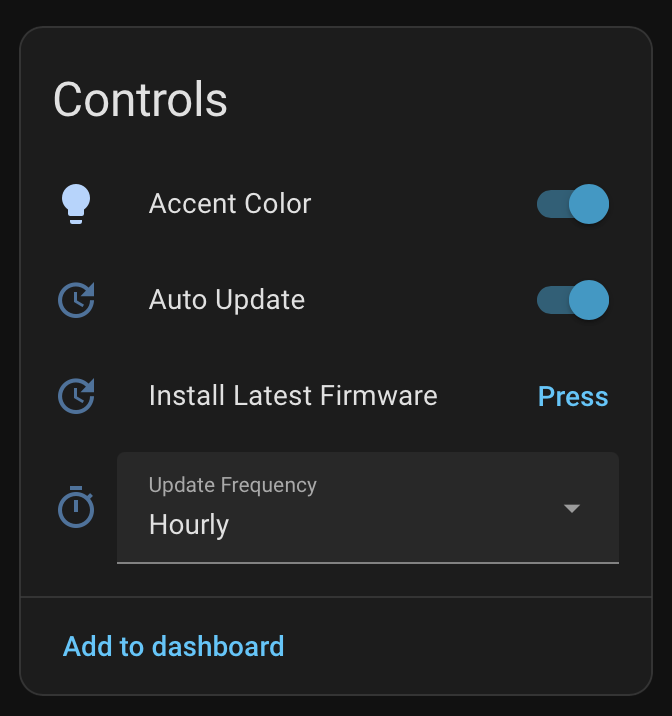

# Settings

Most settings are configurable from the device page in Home Assistant (**Settings → Devices & Services → ESPHome** → your device) — no YAML or reflashing needed.

## Display

| Setting | Description |
|---------|-------------|
| **Day/Night: Active Brightness** | Screen brightness during active use. Automatically adjusts between day and night values based on the `sun.sun` entity in Home Assistant. |
| **Day/Night: Dim Brightness** | Screen brightness when dimmed (screensaver stage 1). |
| **Day/Night: Screen Saver** | When enabled, the screen turns off after the screen-off timeout. When disabled, the screen stays at dim brightness instead of turning off. |

## Timeouts

| Setting | Description |
|---------|-------------|
| **Timeout: Dimming** | Time after playback pauses before the screen dims to the dim brightness level. |
| **Timeout: Screen Off** | Time after dimming before the screen turns off completely (if screen saver is enabled). |

## Speakers

| Setting | Description |
|---------|-------------|
| **Speakers: Auto-Close Timeout** | Time without any touch interaction before the speaker panel automatically closes and returns to the now-playing view. Set to 0 to disable (panel stays open until manually closed). Default: 15 seconds. |

## Playback

| Setting | Description |
|---------|-------------|
| **Playback: Show Remaining Time** | When enabled, the time label shows elapsed and remaining time. When disabled, it shows elapsed and total duration. Tap the time label on the device to toggle this at any time. |
| **Media Player Entity** | The `media_player` entity to control. |

## Firmware Updates

| Setting | Description |
|---------|-------------|
| **Auto Update** | When enabled, firmware updates are installed automatically when detected. Default: on. |
| **Update Frequency** | How often the device checks for updates: Hourly, Daily (default), or Weekly. |
| **Firmware Update** | Shows current and latest firmware versions with an install button when an update is available. |
| **Install Latest Firmware** | Manually triggers an update check and install. |

See [Firmware Updates](/features/firmware-updates) for full details.
| **Sonos Tv Source** | (Optional) Entity ID of a TV media player for [TV Source](/features/tv-source) mode. Leave empty to disable. |
| **Speaker Group Sensor** | (Optional) Entity ID of the template sensor for [Speaker Grouping](/features/speaker-grouping). Leave empty to disable. |
